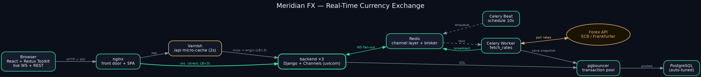
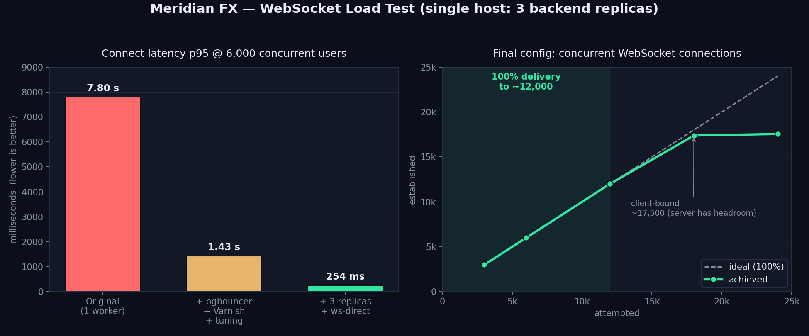

# Meridian FX — Real-Time Currency Exchange

A containerized, production-style real-time foreign-exchange app. Live exchange
rates are streamed over **WebSockets** to a React/Redux frontend, with an instant
currency converter and historical charts. Rates are polled from the European
Central Bank (via Frankfurter) every 10 seconds, persisted as a time series, and
broadcast to every connected browser.

The stack is built to scale: an **nginx** front door, a **Varnish** API
micro-cache, horizontally-scalable **Django + Channels** backends, **Celery**
for polling, **Redis** as the channel layer/broker, and **pgbouncer** in front of
**PostgreSQL** — with each container auto-tuning itself to its CPU/RAM allocation.

---

## Architecture



| Layer | Role |
|---|---|
| **nginx** (front door) | Serves the SPA; routes `/ws` **directly** to the backend (load-balanced across replicas); routes `/api` through Varnish. |
| **Varnish** | Micro-caches `GET /api` (~2 s) to absorb load spikes. WebSockets bypass it. |
| **backend ×N** | Django + Channels on uvicorn (ASGI). REST API + `/ws/rates/` consumer. |
| **Celery Beat + Worker** | Beat schedules `fetch_rates` every 10 s; the worker fetches the forex API, saves a snapshot, and broadcasts the latest rates. |
| **Redis** | Channels channel layer (WS fan-out) + Celery broker. |
| **pgbouncer** | Transaction-mode connection pooling in front of Postgres. |
| **PostgreSQL** | Currencies + time-series exchange-rate history. |

**Data flow:** `Celery Beat → Worker → Forex API → Postgres (+ Redis broadcast) → Channels consumer → all browsers → Redux store → UI`.

---

## Tech stack

- **Backend:** Django 5, Django Channels, Celery, Redis, PostgreSQL 16, Django REST Framework, uvicorn, django-environ, pytest
- **Frontend:** React 18, Vite, Redux Toolkit, RTK Query, Recharts, Vitest, Bootstrap 5
- **Infra:** Docker Compose, nginx, Varnish 7, pgbouncer

---

## Quick start

Requires Docker and Docker Compose.

```bash
cp .env.sample .env
docker compose up --build
```

Then open **http://localhost:8080**.

> The compose file publishes the front door on `8080`. If that port is taken,
> map another with an override file, e.g. `docker compose -f docker-compose.yml -f local-override.yml up`.

### Scaling the backend

```bash
docker compose up -d --scale backend=5   # or set deploy.replicas in docker-compose.yml
```

WebSocket connections load-balance across replicas automatically (nginx + Docker
DNS); broadcasts reach every client through the shared Redis channel layer.

---

## Configuration

All configuration lives in a single root `.env` (see `.env.sample`):

| Key | Purpose |
|---|---|
| `SECRET_KEY`, `DEBUG`, `ALLOWED_HOSTS` | Django core |
| `POSTGRES_*`, `POSTGRES_HOST=pgbouncer` | DB (backend talks to pgbouncer) |
| `DB_DISABLE_SERVER_SIDE_CURSORS`, `CONN_MAX_AGE` | pgbouncer transaction-pooling compatibility |
| `PG_MAX_CONNECTIONS` | Postgres connection ceiling |
| `REDIS_URL`, `CELERY_BROKER_URL`, `CELERY_RESULT_BACKEND` | Redis / Celery |
| `FOREX_API_BASE_URL`, `BASE_CURRENCY`, `POLL_INTERVAL_SECONDS`, `SUPPORTED_CURRENCIES` | App behaviour |

### Resource-aware auto-tuning

Each container reads its **cgroup CPU/RAM allocation** at startup and tunes itself
(works with the per-service `cpus` / `mem_limit` caps in `docker-compose.yml`):

- **PostgreSQL** — `shared_buffers` (25% RAM), `effective_cache_size` (75% RAM), `work_mem`, and parallel workers (CPU count).
- **backend** — `uvicorn --workers` = 2× CPU.
- **Varnish** — malloc cache = 75% RAM.

---

## Performance

WebSocket load test on a single host (3 backend replicas, 4 GB each):



| Stage | Healthy concurrent users | Connect p95 @ 6k | Bottleneck |
|---|---|---|---|
| Original (1 worker, no pool, `DEBUG=on`) | ~6,000 | **7.8 s** | backend connect (per-request DB query) |
| + pgbouncer + Varnish + tuning | ~6,000 | **1.43 s** | backend RAM |
| **+ 3 replicas + ws-direct + raised limits** | **~12,000** | **254 ms** | the test client (server has headroom) |

At the final stage, ~12,000 concurrent viewers get 100% delivery with sub-400 ms
connects; the ~17.5k ceiling in the test is **client-bound** (a single load
generator exhausting ephemeral ports), while the backend replicas sat at only
1.7 / 4 GB. Capacity scales roughly linearly with backend replicas and RAM.

*Methodology:* a Node WebSocket client ramps concurrent connections against the
front door, measuring connect latency, established connections, and whether each
client receives a live broadcast.

---

## Testing

**Backend** (needs Postgres + Redis — easiest via the running stack):

```bash
docker compose run --rm -e POSTGRES_HOST=postgres -e POSTGRES_PORT=5432 backend python -m pytest
```

**Frontend:**

```bash
cd frontend
npm install
npm test
```

---

## Project structure

```
.
├── backend/              # Django project (config/) + rates app, Dockerfile, entrypoint
│   ├── config/           # settings, asgi, celery, urls
│   └── rates/            # models, fetcher, services, tasks, consumers, API, tests
├── frontend/             # Vite + React + Redux Toolkit app, nginx config, Dockerfile
│   └── src/              # store (slices, ws middleware, RTK Query), components
├── infra/
│   ├── postgres/         # tuned Postgres image (cgroup-aware)
│   ├── pgbouncer/        # transaction-pool image
│   └── varnish/          # API micro-cache + VCL
├── docs/                 # specs, plans, and these diagrams
├── docker-compose.yml
└── .env.sample
```

---

## Disclaimer

Exchange rates are sourced from the European Central Bank for informational
purposes only — this is not investment advice.
